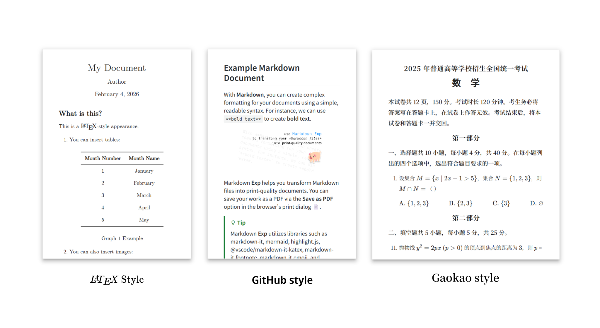

<a href="https://waterblock79.github.io/markdown-exp" about="_blank"><h2 align="center">Markdown Exp</h2></a>

<a href="https://waterblock79.github.io/markdown-exp"></a>


<p align=center>
Markdown <b>Exp</b> is a clean, powerful, open-source converter that transforms your Markdown into <b>print-quality PDFs</b>. <br/>
<a href="https://waterblock79.github.io/markdown-exp"> <b> > Try it out < </b> </a>
</p>

### Features

- 📄 GitHub Flavored Markdown (GFM) support
- 📁 Seamless local asset integration
- 📝 Load files from GitHub repository
- 🖨️ Print-quality document rendering
- 🎨 Multiple optional styles
- 🌐 A clean, instant, no-download experience

### Presets

我们提供了下面的预设样式，默认为 GitHub style：



您可以在文档的 metadata 部分指定样式，也可以在导出时点击 Use Custom Style 切换样式或使用您自己的 Style sheet

```markdown
---
style: github |
---
```

翻译：在 [Github Flavored Markdown](https://docs.github.com/en/get-started/writing-on-github/getting-started-with-writing-and-formatting-on-github/basic-writing-and-formatting-syntax)（包括 Alert 等扩展语法）的基础上，我们还集成了 markdown-it-attrs，您可以通过例如：

```markdown
Centered text{ align=center }

{ width=256px }
```

的语法来更方便地设置属性。

### Screenshots


