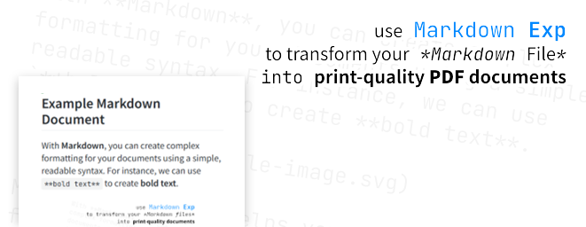
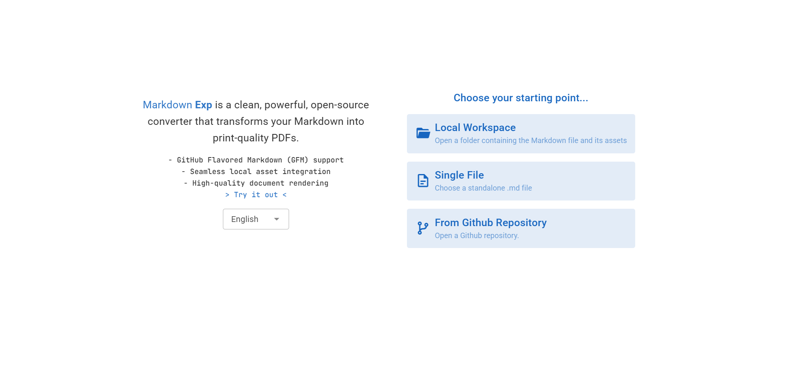
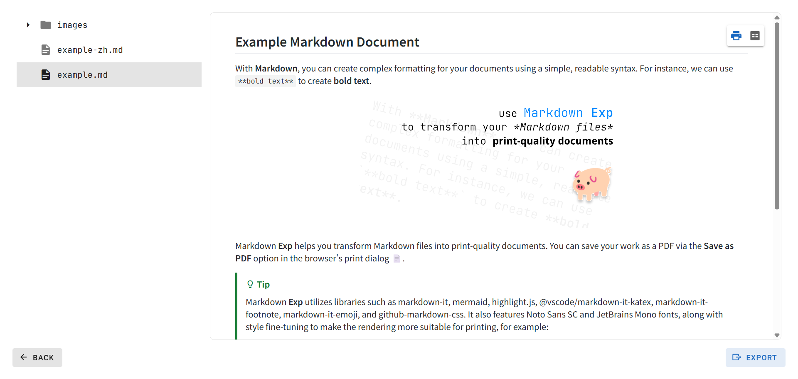
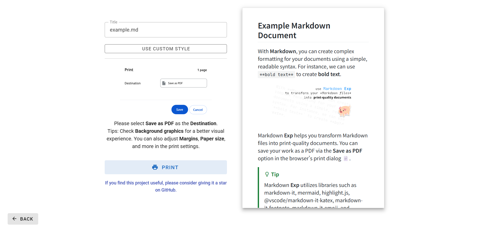

<a href="https://waterblock79.github.io/markdown-exp" about="_blank"><h2 align="center">Markdown Exp</h2></a>

Markdown <b>Exp</b> is a clean, powerful, open-source converter that transforms your Markdown into <b>print-quality PDFs</b>.  
<a href="https://waterblock79.github.io/markdown-exp"> <b> > Try it out < </b> </a>

### Features

- 📄 GitHub Flavored Markdown (GFM) support
- 📁 Seamless local asset integration
- 🖨️ Print-quality document rendering
- 🌐 A clean, instant, no-download experience

### Screenshots

