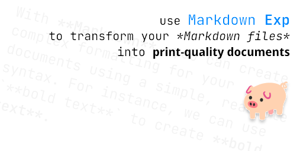

## Example Markdown Document

With **Markdown**, you can create complex formatting for your documents using simple, readable syntax. For example, we can create **bold text** by using `**bold text**`.



Markdown **Exp** helps you render Markdown files into print‑quality documents. You can save the document as PDF via the **Save as PDF** option in your browser's print function :page_facing_up:.

> [!TIP]
> Markdown **Exp** uses the markdown‑it, mermaid, highlight.js, @vscode/markdown‑it‑katex, markdown‑it‑footnote, markdown‑it‑emoji, and github‑markdown‑css
libraries, the Noto Sans SC and Jetbrains Mono fonts, as well as style tweaks to make the document more print‑friendly, for example:
> ```css
> .markdown-body pre,
> .markdown-body code {
>    font-family: "JetBrains Mono", "Noto Sans SC", monospace !important;
>    text-wrap: auto !important;
> }
> ```

The default rendering of Markdown **Exp** stays as consistent as possible with **GitHub‑flavored Markdown**, such as **code blocks**:

```cpp
#include <iostream>
int main() {
    std::cout << "Hello, World!" << std::endl;
    return 0;
}
```

Or $\text{LaTeX}$ formulas:

$$
\text{This is a LaTeX block!}
$$

And **tables**:

| Language | Hello, World! |
| -------- | ------------- |
| C++      | `std::cout << "Hello, World!" << std::endl;` |
| Python   | `print("Hello, World!")` |
| JavaScript | `console.log("Hello, World!");` |
| C        | `printf("Hello, World!\n");` |

Thanks to the File System API, we also support referencing local resources[^1] – the image at the top of this document is a local reference.

If you like Markdown **Exp**, feel free to Star this project!

[^1]: For example, using `` to reference a local image.